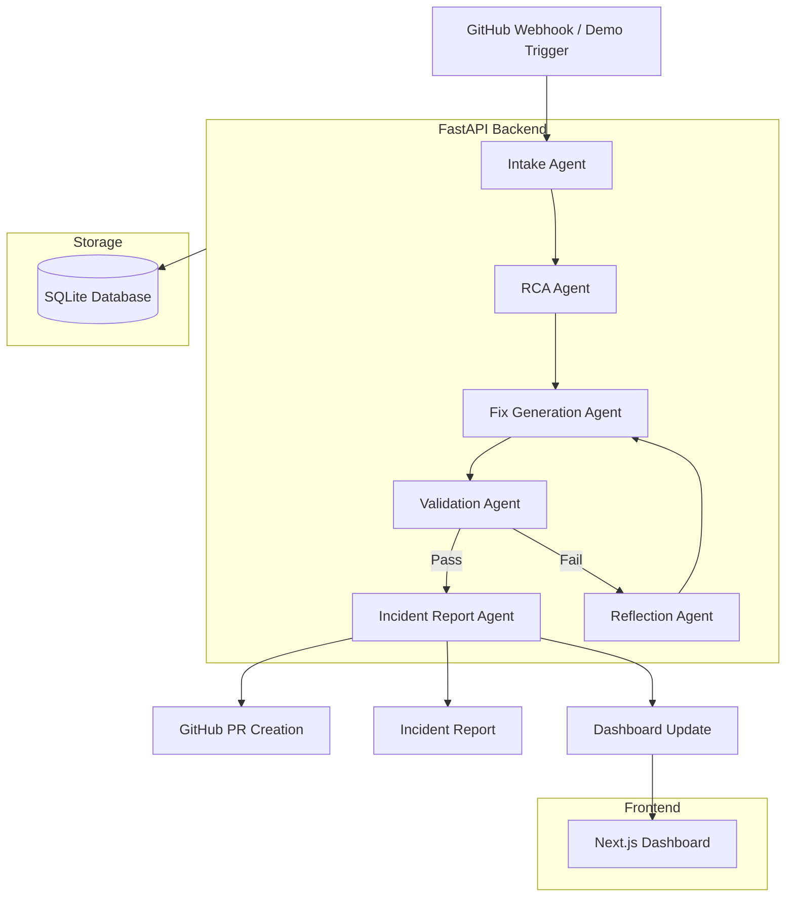
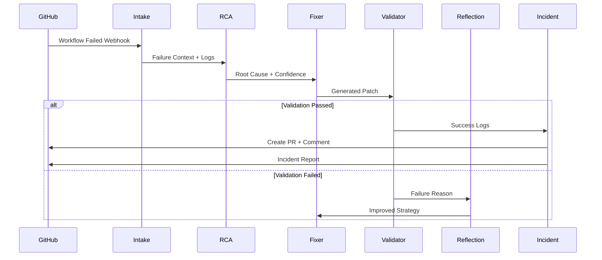
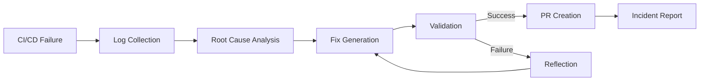

# 🚀 ARGUS - Autonomous CI/CD Failure Fixer

<div align="center">

### **An AI DevOps Engineer that autonomously diagnoses, fixes, validates, and recovers failed CI/CD deployments**

### 🏆 **Built for Scaler School of Technology — Ascent ANVIL Hackathon 2026**

[](https://www.python.org/)
[](https://fastapi.tiangolo.com/)
[](https://nextjs.org/)
[](https://www.langchain.com/langgraph)
[](https://aistudio.google.com/)
[](https://www.docker.com/)
[](https://sqlite.org/)

### ⚡ Detect → Diagnose → Fix → Validate → Recover

*Transform failed CI/CD pipelines into autonomous recovery workflows with AI-powered DevOps intelligence.*

</div>

---

# 📌 Overview

Modern software deployments fail constantly.

Engineering teams spend countless hours manually debugging:

- ❌ Dependency conflicts  
- ❌ Failed tests  
- ❌ Missing environment variables  
- ❌ Docker build failures  
- ❌ TypeScript compilation issues  
- ❌ Broken imports & configurations  
- ❌ Package mismatches  
- ❌ CI/CD pipeline failures  

## Autonomous CI/CD Failure Fixer solves this problem end-to-end.

When a deployment fails, the system autonomously:

1. **Receives** a GitHub webhook (or demo trigger)  
2. **Fetches** CI/CD failure logs  
3. **Classifies** the root cause  
4. **Generates** concrete file patches  
5. **Validates** fixes using real commands  
6. **Retries intelligently** using a Reflection Agent  
7. **Creates GitHub Pull Requests automatically**  
8. **Generates detailed incident reports**

> Think of it as an **AI DevOps Engineer** for failed deployments.

---

# ✨ Key Features

### 🤖 True Multi-Agent Architecture
Specialized agents collaborate autonomously instead of relying on a single LLM prompt chain.

### 🔍 Root Cause Analysis
Detects and classifies failures:

- Dependency mismatches
- Missing environment variables
- Docker build issues
- TypeScript errors
- Failing tests
- Broken imports

### 🛠 Autonomous Fix Generation
Automatically patches:

- `requirements.txt`
- `package.json`
- `Dockerfile`
- `.env.example`
- Config files
- Import paths

### ✅ Deterministic Validation
Runs real commands:

```bash
pytest
npm install
npm build
npm test
docker build
flake8
eslint
```

### 🔁 Reflection & Retry Loop
Failed fixes are analyzed and retried intelligently (max 2 retries).

### 📊 Incident Reporting
Generates:

- Root Cause Analysis (RCA)
- Timeline
- Confidence Score
- Validation Evidence
- Remediation Summary

### 🐳 Local-First & Completely Free
- No AWS required
- No Kubernetes required
- No paid infrastructure
- Fully Dockerized
- Replayable deterministic demo mode

---

# 🏗 System Architecture



---

# 🧠 Multi-Agent Workflow



---

# 🛠 Tech Stack

| Layer | Technology |
|--------|------------|
| Frontend | Next.js 14 + Tailwind CSS |
| Backend | FastAPI |
| Orchestration | LangGraph |
| LLM | GROQ + Gemini Flash Fallback + OpenRouter Fallback |
| Database | SQLite |
| Containerization | Docker Compose |
| CI/CD Integration | GitHub API + Webhooks |

---

# 🚀 Quick Start

## 1️⃣ Clone Repository

```bash
git clone <repo-url>
cd cicd-failure-fixer
```

---

## 2️⃣ Configure Environment

```bash
cp .env.example .env
```

Add required variables:

```env
GEMINI_API_KEY=your_key_here
OPENROUTER_API_KEY=optional
GITHUB_TOKEN=optional
GITHUB_WEBHOOK_SECRET=optional
DEMO_MODE=true
```

---

## 3️⃣ Run with Docker Compose

```bash
docker compose up --build
```

### Services

| Service | URL |
|---------|-----|
| Frontend Dashboard | http://localhost:3000 |
| Backend API | http://localhost:8000 |
| API Docs | http://localhost:8000/docs |

---

# 🎬 Demo Scenarios

The project includes **5 intentionally broken repositories** for deterministic demos.

| Scenario | Failure Type | Difficulty |
|----------|--------------|------------|
| `env_missing` | Missing `DATABASE_URL` | 🟢 Easy |
| `dep_conflict` | Package dependency mismatch | 🟡 Medium |
| `docker_build` | Broken Docker build | 🟡 Medium |
| `ts_error` | TypeScript compilation issue | 🔴 Hard |
| `test_failure` | Failing tests | 🔴 Hard |

### Trigger Demo

```bash
curl -X POST http://localhost:8000/demo/trigger/env_missing
curl -X POST http://localhost:8000/demo/trigger/dep_conflict
curl -X POST http://localhost:8000/demo/trigger/docker_build
curl -X POST http://localhost:8000/demo/trigger/ts_error
curl -X POST http://localhost:8000/demo/trigger/test_failure
```

Then open:

```text
http://localhost:3000
```

to watch the agents collaborate.

---

# 📂 Project Structure

```text
cicd-failure-fixer/
├── backend/
│   ├── main.py                  # FastAPI app entry point
│   ├── config.py                # Settings (pydantic-settings)
│   ├── database.py              # SQLAlchemy models + SQLite
│   ├── agents/
│   │   ├── graph.py             # LangGraph DAG definition
│   │   ├── state.py             # Shared WorkflowState TypedDict
│   │   ├── intake_agent.py      # Log fetching + parsing
│   │   ├── rca_agent.py         # Root cause classification
│   │   ├── fix_agent.py         # Patch generation
│   │   ├── validation_agent.py  # Deterministic test runner
│   │   ├── reflection_agent.py  # Retry + improvement logic
│   │   └── incident_agent.py    # Report + PR creation
│   ├── routers/
│   │   ├── webhook.py           # GitHub webhook receiver
│   │   ├── workflows.py         # Workflow CRUD API
│   │   └── demo.py              # Demo scenario triggers
│   ├── tools/
│   │   ├── github_tool.py       # GitHub API wrapper
│   │   ├── log_parser.py        # Log signal extraction
│   │   ├── file_patcher.py      # Unified diff + file editing
│   │   └── shell_executer.py    # Safe subprocess runner
│   └── demo/
│       ├── scenarios.py         # Scenario registry
│       └── fixtures/            # 5 pre-built JSON log fixtures
├── frontend/
│   └── src/
│       ├── app/                 # Next.js App Router pages
│       └── components/          # Reusable UI components
├── docker-compose.yml
└── .env.example
```

---

# 🤖 Agent System

## 1. Intake Agent
Receives GitHub webhook events and extracts failure logs.

## 2. RCA Agent
Performs root cause analysis using deterministic parsing + LLM reasoning.

## 3. Fix Generation Agent
Generates patches for dependencies, configs, Docker files, and source code.

## 4. Validation Agent
Runs deterministic checks:

```bash
pytest
npm build
docker build
```

## 5. Reflection Agent
Retries failed fixes intelligently.

## 6. Incident Report Agent
Creates:

- GitHub PR Summary
- Incident Timeline
- Root Cause Report
- Validation Evidence

---

# 🔄 Workflow Lifecycle



---

# 🌟 Why This Project Matters

CI/CD failures cost engineering teams:

- ⏳ Engineering time  
- 💰 Productivity loss  
- 🚀 Slower release velocity  
- 😵 Developer frustration  

This project demonstrates how **autonomous AI systems can become engineering copilots**, reducing repetitive debugging work and accelerating deployments.

---

# 🛣 Future Roadmap

- [ ] Real GitHub PR creation
- [ ] Slack/Discord incident alerts
- [ ] Kubernetes deployment diagnostics
- [ ] Historical incident memory
- [ ] Autonomous rollback support
- [ ] Multi-repository orchestration

---

# 🏆 Hackathon Details

**Event:** Scaler School of Technology — Ascent ANVIL Hackathon 2026  
**Track:** Multi-Agent Autonomous Pipeline  
**Category:** Enterprise DevOps Automation using AI Agents

---

# 🤝 Contributing

Contributions, ideas, and improvements are welcome.

```bash
fork → clone → branch → commit → PR
```

---

# 👨‍💻 Team

<div align="center">

<table>
<tr>
<td align="center" width="50%">

### **Ashutosh Kshitij Mishra**

<a href="https://www.linkedin.com/in/ashutoshm04/">
  
</a>
<a href="https://github.com/ashutoshm2004">
  
</a>

</td>

<td align="center" width="50%">

### **Aditya Kumar Pandey**

<a href="https://www.linkedin.com/in/aditya-kumar-pandey-7915a7347/">
  
</a>
<a href="https://github.com/adityakumarpandey1">
  
</a>

</td>
</tr>
</table>

</div>
---

# 📜 License

MIT License © 2026

---


